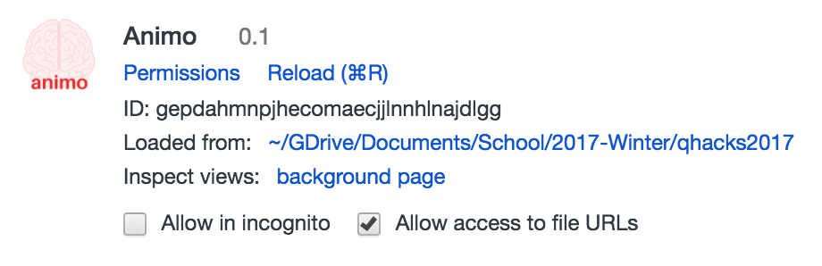
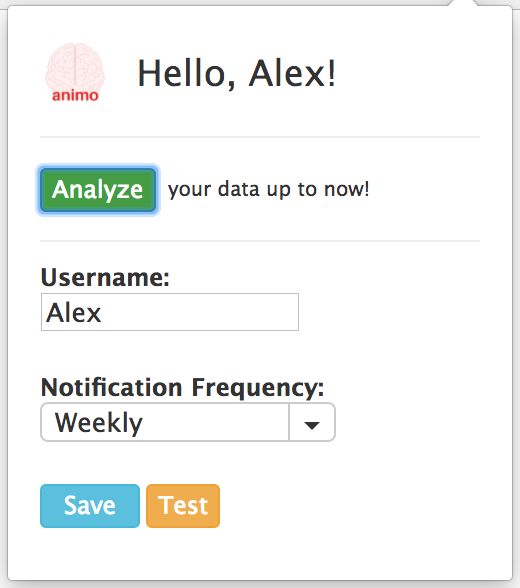
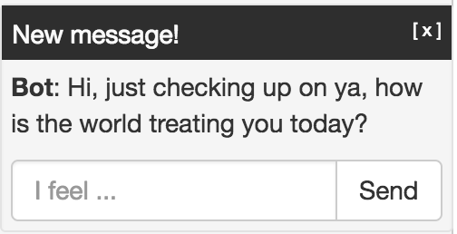
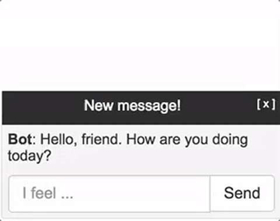

  qhacks2017

------------

#### Version:`1.0`

------

&nbsp;&nbsp;&nbsp;&nbsp;&nbsp;&nbsp;&nbsp;&nbsp;&nbsp;&nbsp;&nbsp;&nbsp;

#### *Luisa Rojas* &nbsp;&nbsp;&nbsp;&nbsp;&nbsp;&nbsp;&nbsp;&nbsp; *Alexandar Mihaylov*

# About
*Animo* is your friend that always checks up on your when in need. *Animo* will poke you from time to time to see how you are doing. It will ask you questions depending on your mood and use sentiment analysis to adequately respond to them. Sometimes it will respond with a joke, sometimes with a motivational speech, depending on the situation. The main goal of *Animo* is to improve your mental health by either reinforcing good moods, or by lending out a helping hand when in a bad one.

# Specifics

*Animo* is a chrome extension comprised of two different moving parts. One is the popup window that is activated by clicking the  icon on the top right hand side of the browser. It opens up a menu that allows the user to fill in their name and how often they would like to be poked.

This also allows you to analyze your past submissions and see what mood you were in at that given time.

The second moving part involves *Animo* actually poking you to check up on how your day is actually going. Regardless of the website that you are on a message will pop up in the bottom right corner of the screen with a simple greeting from *Animo*. This allows you to write down exactly how you feel at that given time, in a journal like manner, and be given a response that is targeted to help with the specific mood that you are in. 

All the messages are logged and secret only to you, with the purpose of allowing you to express yourself to the fullest without worry of judgement. You will be able to go back and review any old messages and see how your mood changes over time. Below is a sample interaction with *Animo*

